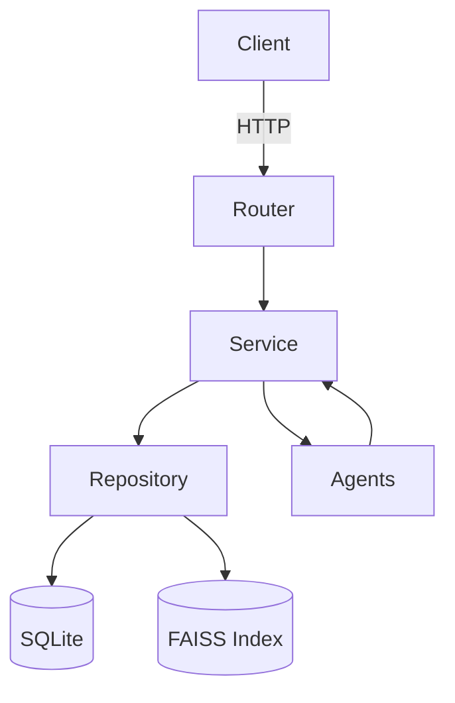

# Hitherto Copilot Instructions

## Architecture Overview
Hitherto is an LLM-first financial intelligence system that correlates Bloomberg newsletters with stock market movements. The system prioritizes supplying structured context to LLMs for reasoning rather than encoding heavy logic in code.

## Project Structure & Data Flow
```
Backend (FastAPI) → Services → Data Sources
    ↓                  ↓           ↓
  Routers         Stock Data   Newsletters
    ↓           (raw_data/5_min)  (Gmail API)
Frontend (Next.js) ← API ← Vector Store (FAISS)
```



## Critical Development Patterns

### Backend Services (Python/FastAPI)
- **Router Pattern**: All endpoints return `ApiResponse[T]` from `backend/schemas.py`
  ```python
  @router.post("/endpoint")
  async def endpoint(db: Session = Depends(get_db)) -> ApiResponse[ResultType]:
      return ApiResponse.success(service.process(db))
  ```
- **Service Layer**: Keep business logic in `backend/services/`, not in routers
- **Database Models**: SQLAlchemy models in `backend/models.py` with JSON fields for chunked text
- **Stock Data**: **Only use `raw_data/5_min/` files** - constantly updated, other directories are legacy ML training data
- **Repository Pattern**: Services access repositories or external APIs; routers never perform raw SQL
- **Import Style**: Use absolute imports from `backend.` package

### Code Quality Standards
- **Formatting**: Always run `black backend && isort backend` before committing
- **Docstrings**: Use Google style docstrings for all functions
  ```python
  def fetch_user(id: int) -> User:
      """Retrieve a user from the database.
      
      Args:
          id: Primary key of the user.
          
      Returns:
          The matching user or raises `HTTPException` if not found.
      """
  ```
- **SOLID Principles**: Design modules with clear responsibilities and dependency inversion
- **Clean Code**: Keep functions small and focused on single responsibility

### Frontend Patterns (TypeScript/Next.js)
- **React Query Hooks**: All API calls via custom hooks in `frontend/src/hooks/`
  ```typescript
  export const useStockData = (symbol: string) => 
    useQuery({ queryKey: ['stocks', symbol], queryFn: () => api.get(`/stocks/daily/${symbol}`) })
  ```
- **Component Exports**: Centralized in `frontend/src/components/index.ts`
- **Import Pattern**: Always import from folder root using barrel exports
  ```tsx
  import { Sidebar, ChatPanel } from "@/components";
  import { useFilters } from "@/hooks";
  ```
- **Environment**: API URL from `NEXT_PUBLIC_API_URL` in `.env.local`
- **State Management**: Server state via TanStack Query, local UI state via React context or `useState`
- **Styling**: Tailwind CSS with composed classes, avoid inline styles
  ```tsx
  <button className="px-3 py-1 bg-blue-600 text-white rounded">Send</button>
  ```

### Configuration Management
- **Environment Variables**: Store backend settings in `.env`
- **Config Import**: Import from `backend.env` module, never use `os.getenv` directly
  ```python
  from backend import env
  db_url = env.DATABASE_URL
  ```

### Stock Data Processing
- **ONLY USE 5_min Data**: The `raw_data/5_min/` directory is the single source of truth for all stock data
- **Daily Aggregation**: Aggregate 5_min data using OHLCV logic (first open, max high, min low, last close, sum volume)
- **Available Symbols**: AMD, DAVE, GC=F, HAG.DE, INOD, LMT, MRVL, NVDA, PLTR, TSLA
- **Ignore Legacy Data**: `raw_data/daily_*.csv`, `raw_data/intraday/`, and root CSVs are historical ML training data - DO NOT USE

## Key Commands & Workflows

### Backend Development
```bash
cd backend
uvicorn main:app --reload --port 8000  # Start FastAPI server
python -m pytest                        # Run tests
black . && isort .                      # Format code before commit
```

### Frontend Development
```bash
cd frontend
npm run dev           # Start Next.js on port 3000
npm run build        # Production build
npm run test         # Run tests
npm run lint         # Run linter before PR
```

### Database Operations
```bash
cd backend
alembic upgrade head  # Apply migrations
python scripts/populate_db.py  # Initial data load
```

## Critical Integration Points

### Newsletter Processing (Gmail API)
- **Service**: `backend/services/email_service.py` handles all Bloomberg newsletter operations
- **Authentication**: OAuth2 flow with token persistence in `backend/token.pickle`
- **Extraction Pipeline**:
  1. `scan_bloomberg_emails()` - Fetches metadata and stores in DB
  2. `extract_bloomberg_email_text()` - Extracts text/plain content using quopri decoding
  3. `backfill_categories_from_text()` - Derives categories from first line of content
- **Category Parsing**: Categories derived from first non-empty line, converted to snake_case
- **MIME Handling**: Prefers largest text/plain part in multipart messages

### Vector Store (FAISS)
- Index location: `backend/faiss_index/` or `db/faiss_store/`
- Embedding model: `text-embedding-ada-002`
- Context retrieval: `backend/services/context.py`

### Stock Data Sources
1. **Primary**: 5-minute bars in `raw_data/5_min/` (ONLY source for production)
2. **Real-time quotes**: yfinance API (fallback for live prices)
3. **Legacy/Training**: Other CSV files are for ML model training only

### Agent Communication
- **JSON Contracts**: Agents exchange structured JSON messages with services
- **No Natural Language**: Agents communicate via data contracts, not natural language between modules
- **Service Integration**: Services query SQL database and FAISS vector store for context before responding

## Project-Specific Conventions

### Error Handling
- Always return `ApiResponse` with success=False rather than raising exceptions in routers
- Log errors with `logger.error(f"Context: {error}")` before returning

### Type Safety
- Use Pydantic models for all API payloads
- TypeScript interfaces mirror backend schemas in `frontend/src/lib/types.ts`
- Components accept explicit typed props: `NewsletterTable({ data: NewsletterLite[] })`

### LLM Context (Future Implementation)
- LLM integration being developed in main `hitherto` folder
- Chunks should be ~1000 tokens with 200 token overlap
- Always include metadata (date, sender, category) when providing context to LLM

### Commit Standards
- Use [Conventional Commits](https://www.conventionalcommits.org/) format
  ```
  feat: add sentiment signal format to module docs
  fix: correct stock data aggregation logic
  docs: update API documentation
  ```
- Keep commits focused on single changes
- Pull requests should describe intent and link relevant issues

## Testing Approach
- Backend: pytest with fixtures in `backend/tests/conftest.py`
- Frontend: Jest + React Testing Library
- E2E: Manual testing via timeline view at `localhost:3000`
- **Pre-commit checks**: Run tests and linting before opening PRs
  ```bash
  pytest -q
  cd frontend && npm run lint
  ```

## Architectural Boundaries & Anti-patterns

### Enforce Boundaries
- **Routers → Services → Repositories → Database**
- Components consume hooks; they should not call `api` directly except in dedicated hooks
- State shared across components goes through context providers
- Services expose functions with clear interfaces: `extract_all(db: Session) -> Count`

### Common Pitfalls to Avoid
- **Don't use relative imports in backend** - use absolute imports from `backend.`
- **Don't use legacy CSV files** - only use `raw_data/5_min/` for stock data
- **Don't create synthetic data** - aggregate directly from 5_min data
- **Don't hardcode dates** - use timezone-aware datetime with `pytz.UTC`
- **Don't skip the `vectorized` flag** when processing newsletters
- **Don't let routers access database directly** - always go through services
- **Don't let components bypass hooks** to call API directly
- **Don't create cross-folder imports** that break encapsulation (e.g., `frontend` importing from `backend`)
- **Don't import FastAPI objects in services** - keep separation of concerns

## LLM Co-authoring Guidelines
- Begin prompts with short system message outlining constraints
- Specify expected return type or interface explicitly
  ```text
  System: "You are a helpful code generator. Return only valid TypeScript."
  User: "Create a `useCounter` hook that increments and decrements."
  Expected output: Hook returning {count, increment, decrement}
  ```
- Provide relevant context and expected output shape
- Review generated code before committing

## Key Files to Reference
- `backend/services/stock_data.py` - Stock data aggregation from 5_min files
- `backend/services/email_service.py` - Bloomberg newsletter extraction pipeline
- `frontend/src/components/NewsletterTimeline.tsx` - Main timeline visualization
- `backend/routers/stocks.py` - Stock API endpoints
- `backend/models.py` - Database schema
- `agents/modules/` - Agent module specifications with JSON contracts
- `debug_tools/` - Manual Gmail API helpers for debugging

## Copilot Response Behavior

### Response Format
- **Be concise**: Provide direct solutions without unnecessary explanation unless asked
- **Code-first**: Lead with code blocks, follow with brief explanations only if complex
- **Complete implementations**: Don't use placeholders like `// ... rest of implementation` unless specifically showing integration points
- **Working examples**: Provide runnable code that handles edge cases and errors

### Context Awareness
- **Check existing patterns**: Before suggesting new approaches, reference existing implementations in the codebase
- **Maintain consistency**: Follow the established patterns in nearby files rather than introducing new paradigms
- **Respect boundaries**: Don't suggest crossing architectural layers (e.g., router accessing DB directly)
- **Use existing utilities**: Prefer existing helper functions and services over reimplementing

### Code Generation Rules
- **Import resolution**: Always verify imports exist before suggesting them
- **Type safety**: Include all necessary type annotations and interfaces
- **Error handling**: Include try-catch blocks and proper error responses using `ApiResponse`
- **No mock data**: Use actual data sources (`raw_data/5_min/`) never generate fake data
- **Complete functions**: Include all necessary imports, error handling, and return statements

### Problem-Solving Approach
- **Diagnose first**: When debugging, identify the root cause before suggesting fixes
- **Minimal changes**: Prefer surgical fixes over large refactors unless specifically requested
- **Performance aware**: Consider performance implications for operations on large datasets
- **Security conscious**: Never expose sensitive data, use environment variables for secrets

### Communication Style
- **Direct and technical**: Use precise technical terms, avoid vague descriptions
- **Action-oriented**: Start responses with what will be done ("Creating...", "Updating...", "Fixing...")
- **Highlight critical changes**: Use comments like `# IMPORTANT:` for breaking changes or critical updates
- **Warn about side effects**: Explicitly mention if changes affect other parts of the system

### When Uncertain
- **Ask for clarification**: Request specific details rather than making assumptions
- **Provide alternatives**: Offer multiple approaches with trade-offs when solution isn't clear
- **Reference documentation**: Point to relevant module docs or existing examples
- **Escalate complexity**: Suggest breaking complex tasks into smaller, reviewable steps

### File Modification Guidelines
- **Preserve existing code**: Use `// ...existing code...` markers to show context without rewriting everything
- **Clear file paths**: Always include `// filepath:` comment when modifying existing files
- **Atomic changes**: Each code block should represent one logical change
- **Migration safety**: When changing schemas or models, suggest migration steps

### Testing & Validation
- **Include test cases**: Provide test examples for new functions or complex logic
- **Validation first**: Check inputs and preconditions before processing
- **Sample commands**: Include exact CLI commands for testing changes
- **Expected output**: Show what successful execution looks like

### Domain-Specific Responses

#### For Stock Data Requests
- Always use `raw_data/5_min/` files
- Include proper aggregation logic for different timeframes
- Validate symbol exists in available list (AMD, DAVE, GC=F, etc.)

#### For Newsletter Processing
- Reference existing email_service.py patterns
- Include proper MIME handling and quopri decoding
- Ensure vectorization flag is set after processing

#### For Frontend Components
- Use existing hooks from `@/hooks`
- Follow NewsletterTimeline.tsx patterns
- Include proper TypeScript types from `@/lib/types`

#### For Agent Modules
- Return structured JSON responses only
- Follow module contract specifications exactly
- Never use natural language between modules

### Examples of Good Responses

#### Good: Direct, complete, working code
```python
# Creating endpoint to fetch newsletter by ID
@router.get("/newsletters/{newsletter_id}")
async def get_newsletter(
    newsletter_id: int,
    db: Session = Depends(get_db)
) -> ApiResponse[Newsletter]:
    """Fetch single newsletter with all chunks."""
    try:
        newsletter = db.query(Newsletter).filter(
            Newsletter.id == newsletter_id
        ).first()
        
        if not newsletter:
            return ApiResponse.error(f"Newsletter {newsletter_id} not found")
            
        return ApiResponse.success(newsletter)
    except Exception as e:
        logger.error(f"Error fetching newsletter {newsletter_id}: {e}")
        return ApiResponse.error(str(e))
```

#### Bad: Vague, incomplete, with placeholders
```python
def get_newsletter(id):
    # TODO: implement this
    newsletter = ... # fetch from database
    return newsletter
```

### Priority Order
When multiple guidelines conflict, follow this priority:
1. **Safety & Security** - Never compromise on security
2. **Data Integrity** - Ensure data consistency
3. **Architectural Boundaries** - Maintain clean architecture
4. **Performance** - Optimize where it matters
5. **Readability** - Clear code over clever code


