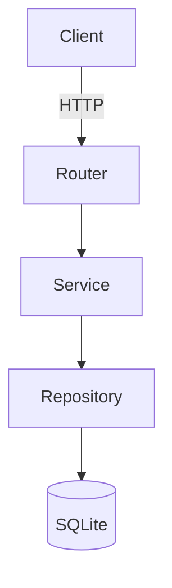

# Architecture Overview

This document describes the major folders in the repository, their responsibilities and the contracts that bind them together.



## backend/

- **Contains:** FastAPI application, routers, services, ORM models.
- **Depends on:** `sqlalchemy`, `pydantic`, external APIs (Gmail, stock quotes).
- **Example:**

```python
@router.post("/ingest/extract_all")
async def extract_all(db: Session = Depends(get_db)) -> ApiResponse[Count]:
    return ApiResponse.success(service.extract_all(db))
```

- **Interfaces:**
  - Routers use Pydantic schemas from `schemas.py`.
  - Services expose functions like `extract_all(db: Session) -> Count`.

### Boundaries

- Routers call services; services access repositories or external APIs.
- Avoid routers performing raw SQL or services importing FastAPI objects.

## frontend/

- **Contains:** Next.js app router, React components, hooks and utilities.
- **Depends on:** `react`, `@tanstack/react-query`, `axios`.
- **Example:**

```tsx
import { Sidebar } from "@/components";
import { useFilters } from "@/hooks";
```

- **Interfaces:**
  - Hooks return typed data (`useStockQuotes(): StockQuote[]`).
  - Components accept explicit props; e.g., `NewsletterTable({ data: NewsletterLite[] })`.

### Boundaries

- Components consume hooks; they should not call `api` directly except in dedicated hooks or actions.
- State shared across components goes through context providers.

## scripts/

- **Contains:** Shell utilities (`clean_pycache.sh`).
- **Depends on:** POSIX shell.
- **Example:** `./scripts/clean_pycache.sh` removes `__pycache__` directories.

## debug_tools/

- **Contains:** Manual Gmail API helpers for local debugging.
- **Depends on:** Google client libraries.
- **Example:** `debug_tools/gmail_quickstart.py` prints unread newsletters.

## agents/

- **Contains:** Prompt files and agent configurations for LLM workflows.
- **Depends on:** none; consumed by humans or automation.
- **Example:** `agents/1. Sentiment Analysis Agent` describes an analysis step.

## db/

- **Contains:** Local FAISS vector index under `faiss_store/`.
- **Depends on:** data generated by `backend/services/vector.py`.
- **Example:** Backend services read from `db/faiss_store` to answer similarity queries.

## Anti-patterns

- Routers accessing the database layer directly without going through services.
- Components bypassing hooks and calling `api` directly.
- Cross-folder imports that break encapsulation (e.g., `frontend` importing from `backend`).

