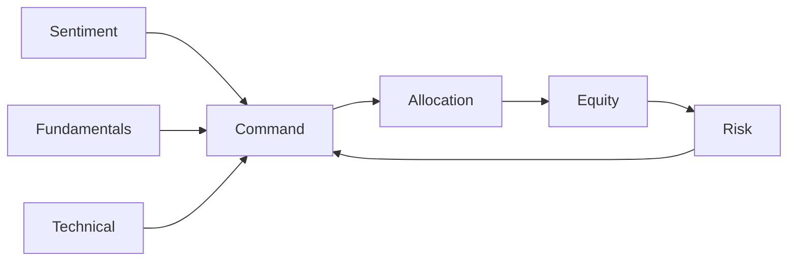

# Supporting Systems

Summaries of cross-module mechanisms that keep Hitherto cohesive and safe.



## Integration & Communication Protocol
- Standard JSON schemas for signals, policy proposals, and risk verdicts.
- Pub/sub messaging ensures modules exchange structured data with minimal context loss.

### Policy proposal schema
```json
{
  "type": "policy_proposal",
  "id": "uuid",
  "content": {
    "action": "increase_position",
    "ticker": "AAPL",
    "size": 100
  }
}
```

## Context Management & Memory
- Rolling synopses and top-K retrieval maintain concise context for LLM agents.
- Hard context limits enforce efficient prompts while retaining relevant history.

## Guardrails & Safety Checks
- Schema validation, anomaly detection, and multi-party approvals enforce safety.
- Kill-switches and human overrides prevent catastrophic actions.

## Evaluation & Continuous Improvement
- KPIs track performance of each module and trigger retraining or refinement.
- Post-mortems and human feedback feed back into the learning loop.
